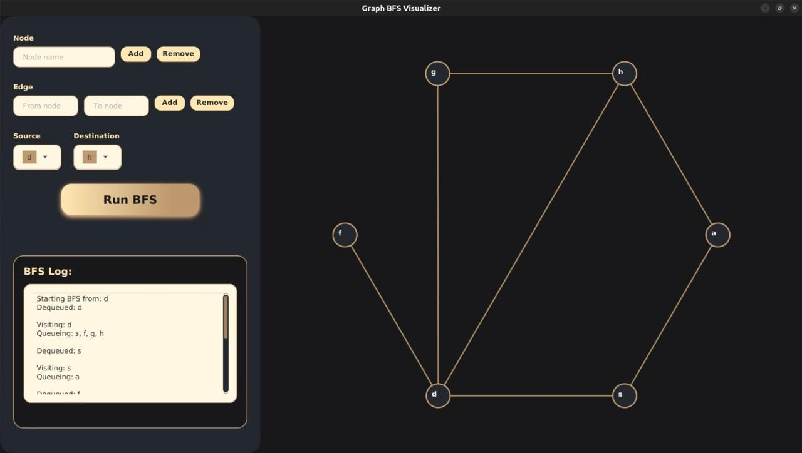
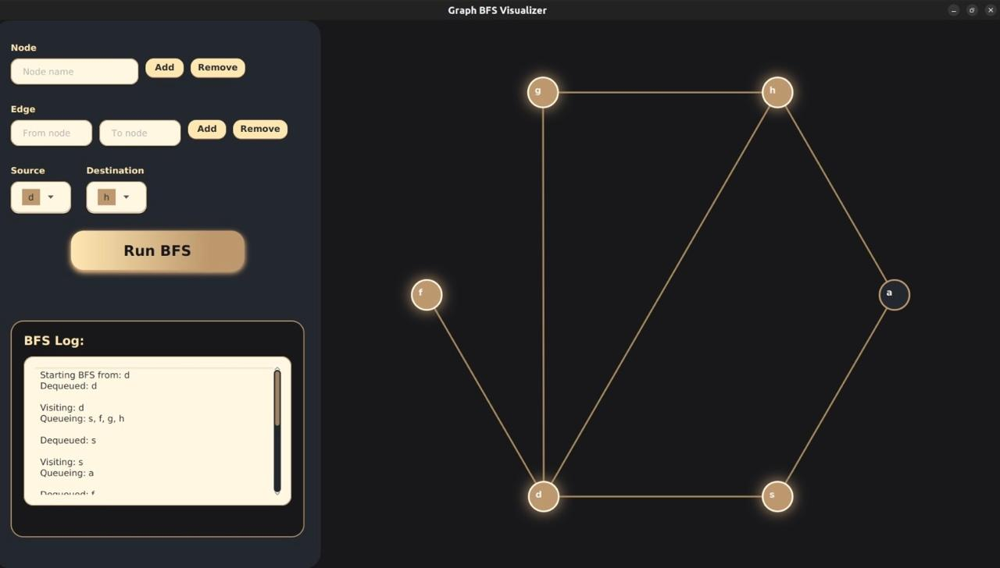
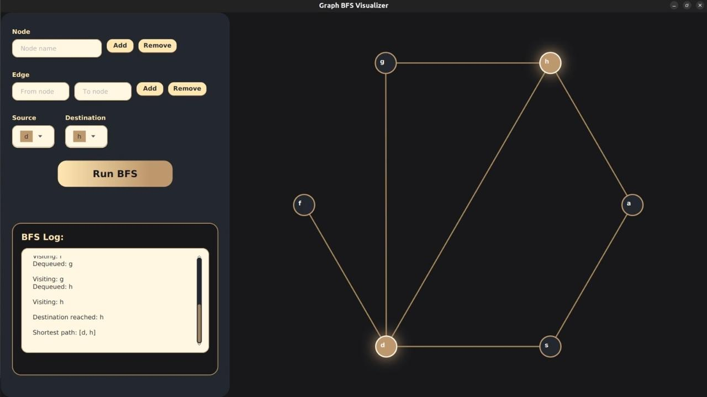

#  BFS Routing Algorithm

A modern, interactive JavaFX application to visualize Breadth-First Search (BFS) traversal and shortest path finding on custom graphs.

---

## Features
- **Add/Remove Nodes and Edges**: Build your own graph visually.
- **BFS Traversal Animation**: Watch BFS in action, step by step.
- **Shortest Path Highlighting**: Only the shortest path remains highlighted at the end.
- **Modern Dark UI**: Beautiful, minimal, and accessible interface.
- **Keyboard Shortcuts**: Press Enter to quickly add nodes/edges.
- **Responsive Layout**: Adapts smoothly to different window sizes and resolutions.

---

## Screenshots
### 1. Full GUI Interface


### 2. Graph Layout with Selected Source and Destination


### 3. BFS Traversal in Progress


### 4. Complete Traversal with Highlighted Shortest Path



## Getting Started

### Prerequisites
- javac 17.0.15
- Apache Maven 3.6.3
- JavaFX SDK 21.0.7(if running manually)

### Build & Run with Maven (Recommended)
1. **Clone the repository:**
   ```bash
   git clone https://github.com/hareem-ariff/RoutingAlgorithmProject.git
   cd RoutingAlgorithmProject

   ```
2. **Run the app:**
   ```bash
   mvn clean javafx:run
   ```

### Manual Run (Without Maven)
1. **Compile:**
   ```bash
   javac -cp /path/to/javafx-sdk-XX/lib/* src/main/java/*.java
   ```
2. **Run:**
   ```bash
   java --module-path /path/to/javafx-sdk-XX/lib --add-modules javafx.controls,javafx.fxml -cp src/main/java GraphBFSApp
   ```

---

## Usage
- **Add Node:** Enter a name, press Enter or click Add.
- **Remove Node:** Enter a name, click Remove.
- **Add Edge:** Enter two node names, press Enter or click Add.
- **Remove Edge:** Enter two node names, click Remove.
- **Run BFS:** Select source and destination, click Run BFS.
- **Logs:** See traversal and queue details in the log panel.


---


